---
## Front matter
lang: ru-RU
title: Установка и конфигурация операционной системы на виртуальную машину
author: |
	 \inst{1}

institute: |
	\inst{1}Российский Университет Дружбы Народов

date: 9 сентября, 2023, Москва, Россия

## Formatting
mainfont: PT Serif
romanfont: PT Serif
sansfont: PT Sans
monofont: PT Mono
toc: false
slide_level: 2
theme: metropolis
header-includes:
 - \metroset{progressbar=frametitle,sectionpage=progressbar,numbering=fraction}
 - '\makeatletter'
 - '\beamer@ignorenonframefalse'
 - '\makeatother'
aspectratio: 43
section-titles: true

---

## Выполнила работу:
Данилова Анастасия Сергеевна НПИбд-01-20

# Цели и задачи работы

## Цель лабораторной работы

Целью данной работы является приобретение практических навыков установки операционной системы на виртуальную машину, настройки минимально необходимых для дальнейшей работы сервисов.

## Создание виртуальной машины

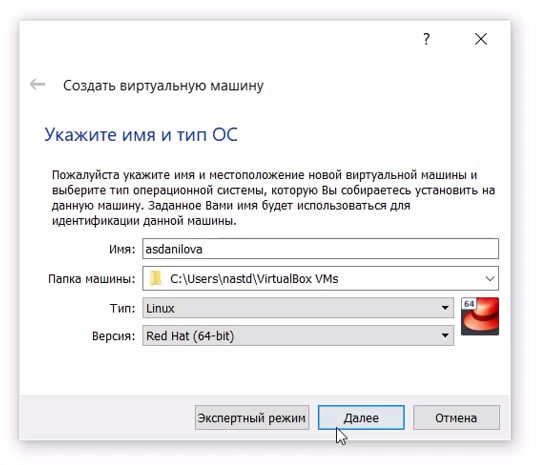

## Создание виртуальной машины

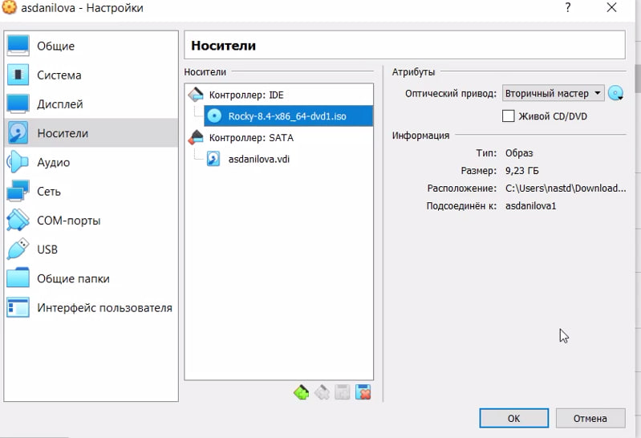
Добаввляем новый привод оптических дисков и выбираем образ
операционной системы

## Настройка системы

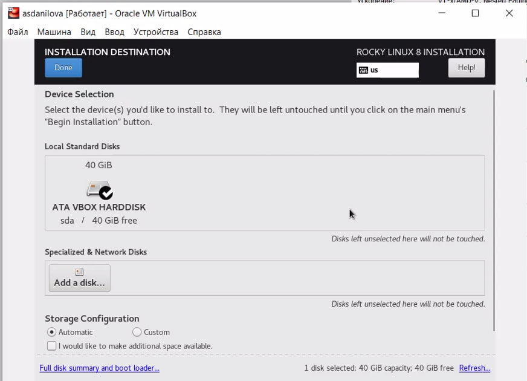

## Настройка системы

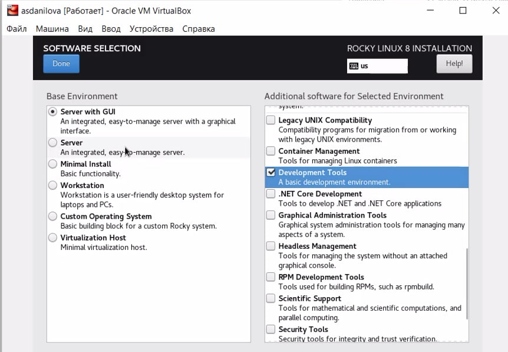

В разделе выбора программ указываем в качестве базового окружения
Server with GUI, а в качестве дополнения — Development Tools

## Настройка системы

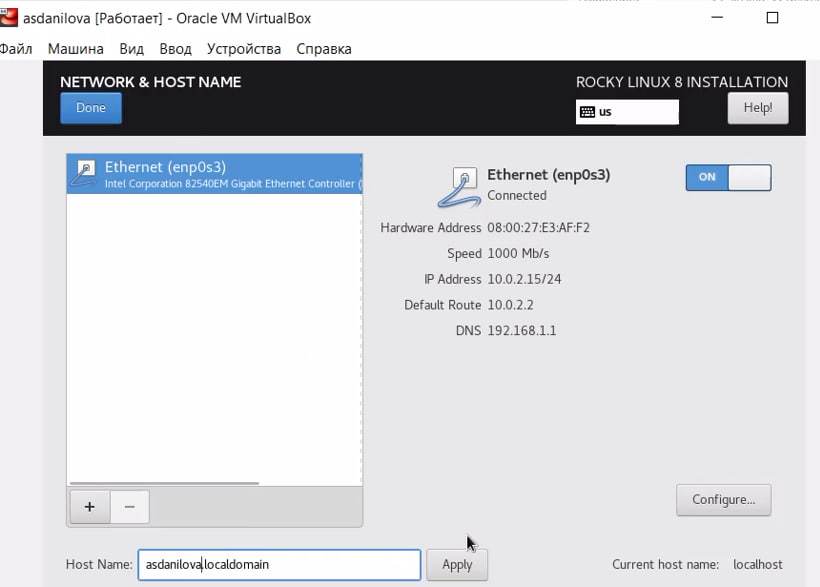

Включим сетевое соединение и укажем имя узла

## Настройка системы

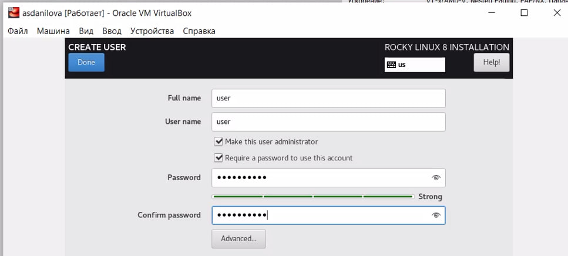

## Настройка системы

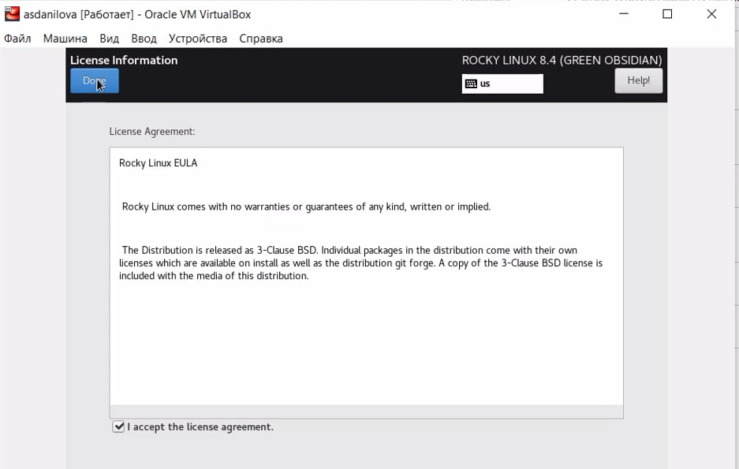

## Настройка

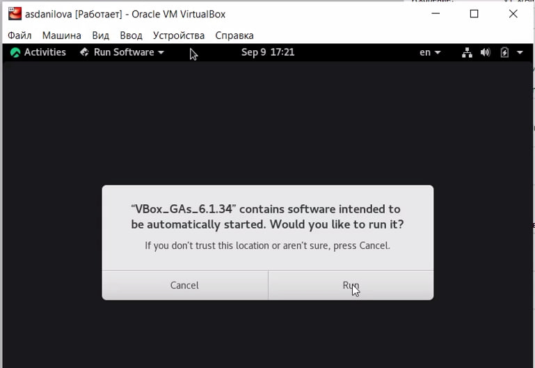

## Установка имени пользователя и названия хоста

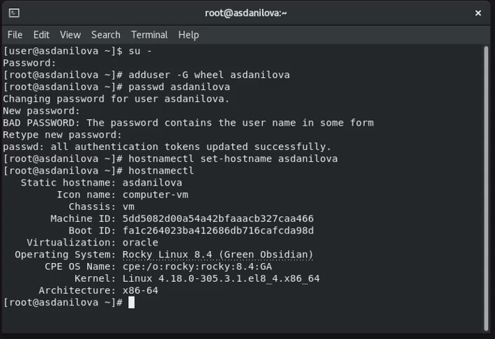

# Задания:

## Версия ядра Linux (Linux version).

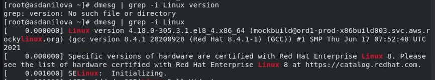

## Частота процессора (Detected Mhz processor).

## Модель процессора (CPU0).

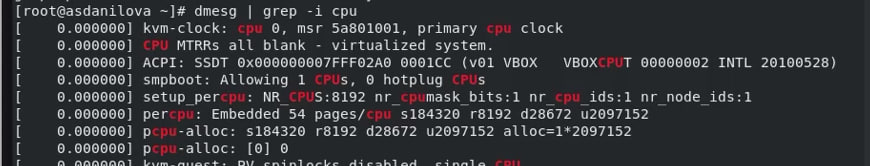

## Объем доступной оперативной памяти (Memory available).

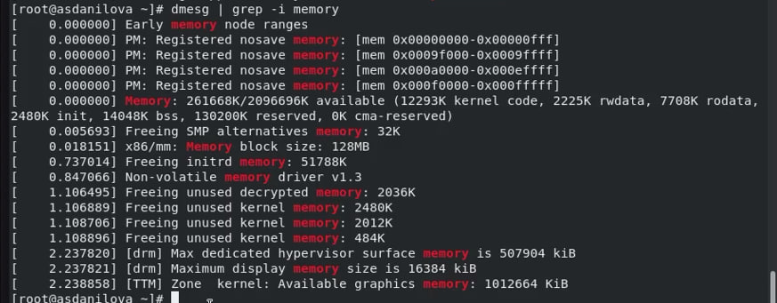

## Тип обнаруженного гипервизора (Hypervisor detected).

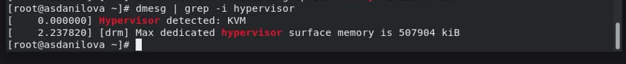

## Тип файловой системы корневого раздела.

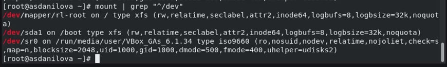

# Выводы по проделанной работе

## Вывод

Я приобрела практические навыки установки операционной системы на виртуальную машину, настройки минимально необходимых для дальнейшей работы сервисов.

