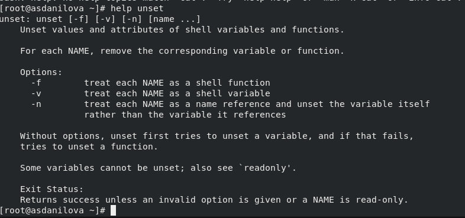

---
# Front matter
lang: ru-RU
title: "Отчёт по лабораторной работе №1"
subtitle: "Развертывание виртуальной машины"
author: "Данилова Анастасия Сергеевна"

# Formatting
toc-title: "Содержание"
toc: true # Table of contents
toc_depth: 2
lof: true # List of figures
fontsize: 12pt
linestretch: 1.5
papersize: a4paper
documentclass: scrreprt
polyglossia-lang: russian
polyglossia-otherlangs: english
mainfont: PT Serif
romanfont: PT Serif
sansfont: PT Sans
monofont: PT Mono
mainfontoptions: Ligatures=TeX
romanfontoptions: Ligatures=TeX
sansfontoptions: Ligatures=TeX,Scale=MatchLowercase
monofontoptions: Scale=MatchLowercase
indent: true
pdf-engine: lualatex
header-includes:
  - \linepenalty=10 # the penalty added to the badness of each line within a paragraph (no associated penalty node) Increasing the value makes tex try to have fewer lines in the paragraph.
  - \interlinepenalty=0 # value of the penalty (node) added after each line of a paragraph.
  - \hyphenpenalty=50 # the penalty for line breaking at an automatically inserted hyphen
  - \exhyphenpenalty=50 # the penalty for line breaking at an explicit hyphen
  - \binoppenalty=700 # the penalty for breaking a line at a binary operator
  - \relpenalty=500 # the penalty for breaking a line at a relation
  - \clubpenalty=150 # extra penalty for breaking after first line of a paragraph
  - \widowpenalty=150 # extra penalty for breaking before last line of a paragraph
  - \displaywidowpenalty=50 # extra penalty for breaking before last line before a display math
  - \brokenpenalty=100 # extra penalty for page breaking after a hyphenated line
  - \predisplaypenalty=10000 # penalty for breaking before a display
  - \postdisplaypenalty=0 # penalty for breaking after a display
  - \floatingpenalty = 20000 # penalty for splitting an insertion (can only be split footnote in standard LaTeX)
  - \raggedbottom # or \flushbottom
  - \usepackage{float} # keep figures where there are in the text
  - \floatplacement{figure}{H} # keep figures where there are in the text
---

## Цель лабораторной работы

Целью данной работы является приобретение практических навыков установки операционной системы на виртуальную машину, настройки минимально необходимых для дальнейшей работы сервисов.

# Процесс выполнения лабораторной работы

## Создаем виртуальную машину
Тип операционной системы — Linux, RedHat

Укажем размер основной памяти виртуальной машины  — 2048МБ

Зададим размер диска — 40 ГБ

Добавим новый привод оптических дисков и выберем образ операционной системы

Раскладка клавиатуры

Место установки ОС оставим без изменения

В разделе выбора программ укажем в качестве базового окружения
Server with GUI, а в качестве дополнения — Development Tools

Включим сетевое соединение и в качестве имени узла укажем user.localdomain

Установим пароль для root и пользователя с правами администратора

Принимаем условия лицензии

Запуск образа диска дополнений гостевой ОС

Корректная перезагрузка машины

## Установка имени пользователя и названия хоста

1. Запустите виртуальную машину и залогиньтесь.
2. Запустите терминал и получите полномочия администратора: su -
3. Создайте пользователя: adduser -G wheel username
4. Задайте пароль для пользователя: passwd usernamе
5. Установите имя хоста: hostnamectl set-hostname username
6. Проверьте, что имя хоста установлено верно: hostnamectl

## Задания:
1. Версия ядра Linux (Linux version).

2. Частота процессора (Detected Mhz processor).

3. Модель процессора (CPU0).

4. Объем доступной оперативной памяти (Memory available).

5. Тип обнаруженного гипервизора (Hypervisor detected).

6. Тип файловой системы корневого раздела.

## Контрольные вопросы

1. Какую информацию содержит учётная запись пользователя?

Она содержит следующее: Где: User ID - логин; Password – наличие пароля; UID - идентификатор пользователя; GID - идентификатор группы по умолчанию; User Info – вспомогательная информация о пользователе (полное имя, контакты и т.д.) Home Dir - начальный (он же домашний) каталог; Shell - регистрационная оболочка.

2. Укажите команды терминала и приведите примеры:
– для получения справки по команде - команды help или man;

– для перемещения по файловой системе cd;

– для просмотра содержимого каталога ls;

– для определения объёма каталога;

– для создания / удаления каталогов / файлов;

Файлы:

Каталоги:

– для задания определённых прав на файл / каталог;

chmod

– для просмотра истории команд.

3. Что такое файловая система? Приведите примеры с краткой характеристикой.

Файловая система  — архитектура хранения данных, которые могут находиться в разделах жесткого диска и ОП. Выдает пользователю доступ к конфигурации ядра. Определяет, какую структуру принимают файлы в каждом из разделов, создает правила для их генерации, а также управляет файлами в соответствии с особенностями каждой конкретной ФС.
Список файловых систем, которые поддерживаются ядром, находится в файле /proc/filesystems

4. Как посмотреть, какие файловые системы подмонтированы в ОС?

Команда findmnt

5. Как удалить зависший процесс?

Командой kill

# Вывод

Мы приобрели практическе навыки установки операционной системы на виртуальную машину. Также настроили минимально необходимые для дальнейшей работы сервисы.
