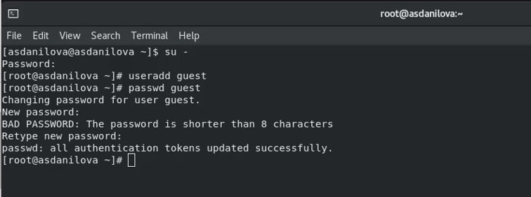
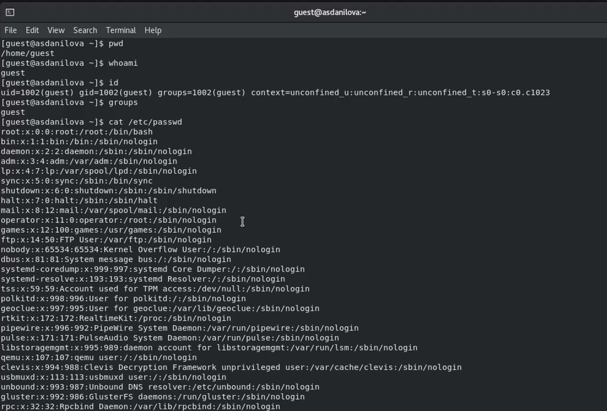
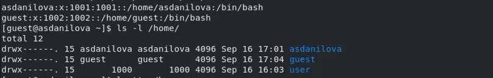
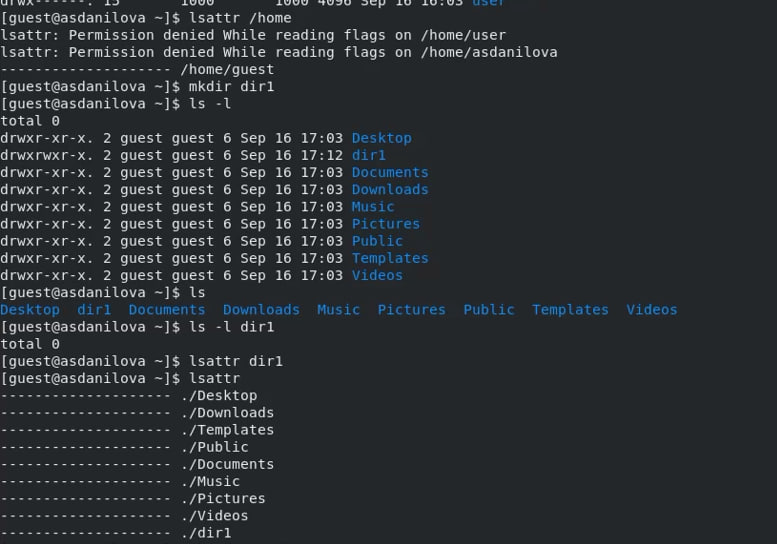
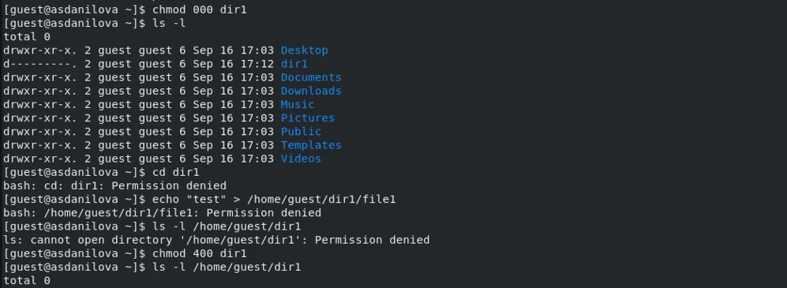
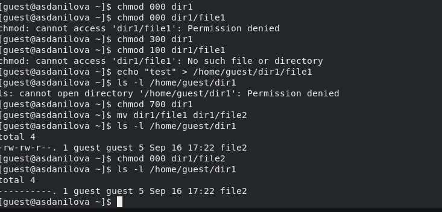

---
# Front matter
lang: ru-RU
title: "Отчёт по лабораторной работе №2"
subtitle: "Дискреционное разграничение прав в Linux. Основные атрибуты"
author: "Данилова Анастасия Сергеевна"

# Formatting
toc-title: "Содержание"
toc: true # Table of contents
toc_depth: 2
lof: true # List of figures
fontsize: 12pt
linestretch: 1.5
papersize: a4paper
documentclass: scrreprt
polyglossia-lang: russian
polyglossia-otherlangs: english
mainfont: PT Serif
romanfont: PT Serif
sansfont: PT Sans
monofont: PT Mono
mainfontoptions: Ligatures=TeX
romanfontoptions: Ligatures=TeX
sansfontoptions: Ligatures=TeX,Scale=MatchLowercase
monofontoptions: Scale=MatchLowercase
indent: true
pdf-engine: lualatex
header-includes:
  - \linepenalty=10 # the penalty added to the badness of each line within a paragraph (no associated penalty node) Increasing the value makes tex try to have fewer lines in the paragraph.
  - \interlinepenalty=0 # value of the penalty (node) added after each line of a paragraph.
  - \hyphenpenalty=50 # the penalty for line breaking at an automatically inserted hyphen
  - \exhyphenpenalty=50 # the penalty for line breaking at an explicit hyphen
  - \binoppenalty=700 # the penalty for breaking a line at a binary operator
  - \relpenalty=500 # the penalty for breaking a line at a relation
  - \clubpenalty=150 # extra penalty for breaking after first line of a paragraph
  - \widowpenalty=150 # extra penalty for breaking before last line of a paragraph
  - \displaywidowpenalty=50 # extra penalty for breaking before last line before a display math
  - \brokenpenalty=100 # extra penalty for page breaking after a hyphenated line
  - \predisplaypenalty=10000 # penalty for breaking before a display
  - \postdisplaypenalty=0 # penalty for breaking after a display
  - \floatingpenalty = 20000 # penalty for splitting an insertion (can only be split footnote in standard LaTeX)
  - \raggedbottom # or \flushbottom
  - \usepackage{float} # keep figures where there are in the text
  - \floatplacement{figure}{H} # keep figures where there are in the text
---

## Цель лабораторной работы

Получение практических навыков работы в консоли с атрибутами файлов, закрепление теоретических основ дискреционного разграничения доступа в современных системах с открытым кодом на базе ОС Linux.

# Процесс выполнения лабораторной работы

1. В установленной при выполнении предыдущей лабораторной работы
операционной системе создайте учётную запись пользователя guest (использую учётную запись администратора):
useradd guest
2. Задайте пароль для пользователя guest (использую учётную запись администратора):
passwd guest
3. Войдите в систему от имени пользователя guest.
  

4. Определите директорию, в которой вы находитесь, командой pwd. Сравните её с приглашением командной строки. Определите, является ли она
вашей домашней директорией? Да, является.
5. Уточните имя вашего пользователя командой whoami.
6. Уточните имя вашего пользователя, его группу, а также группы, куда входит пользователь, командой id. Выведенные значения uid, gid и др. запомните. Сравните вывод id с выводом команды groups. Идентификаторы одинаковые и имеют значение 1002
7. Сравните полученную информацию об имени пользователя с данными,
выводимыми в приглашении командной строки.
8. Просмотрите файл /etc/passwd командой cat /etc/passwd

Наша учетная запись расположена в конце списка. 1002 uid пользователя.
1002 gid пользователя. 

9. Определите существующие в системе директории командой
ls -l /home/

Пользователь имеет полный доступ.

10.   Проверьте, какие расширенные атрибуты установлены на поддиректориях, находящихся в директории /home, командой:
lsattr /home
Удалось ли вам увидеть расширенные атрибуты директории? Да
Удалось ли вам увидеть расширенные атрибуты директорий других
пользователей? Атрибуты других пользователей недоуступны
11.   Создайте в домашней директории поддиректорию dir1 командой
mkdir dir1 
Определите командами ls -l и lsattr, какие права доступа и расширенные атрибуты были выставлены на директорию dir1.

 

12.   Снимите с директории dir1 все атрибуты командой chmod 000 dir1 и проверьте с её помощью правильность выполнения команды ls -l
13.   Попытайтесь создать в директории dir1 файл file1 командой
echo "test" > /home/guest/dir1/file1
Объясните, почему вы получили отказ в выполнении операции по созданию файла?
Мы сняли с директории все атрибуты, следовательно - не можем с ней взаимодействовать. Создать файл и посмотреть директорию мы не можем.
Оцените, как сообщение об ошибке отразилось на создании файла? Проверьте командой ls -l /home/guest/dir1 действительно ли файл file1 не находится внутри директории dir1.

14. Заполните таблицу «Установленные права и разрешённые действия»
(см. табл. 2.1), выполняя действия от имени владельца директории (файлов), определив опытным путём, какие операции разрешены, а какие нет.
Если операция разрешена, занесите в таблицу знак «+», если не разрешена, знак «-».

## Таблица 1

| Права директории  | Права файла | 1 | 2 | 3 | 4 | 5 | 6 | 7 | 8 |
|-------------------|-------------|-----|-----|-----|----|-----|-------|-----|------|
| d---------(000) |  ----------(000) | - | - | - |- | - | - | - | - |
| d--x------(100) |  ----------(000) | - | - | - |- | + | - | - | + |
| d-w-------(200) |  ----------(000) | - | - | - |- | - | - | - | - |
| d-wx------(300) |  ----------(000) | + | + | - |- | + | - | + | + |
| dr--------(400) |  ----------(000) | - | - | - |- | - | - | - | - |
| dr-x------(500) |  ----------(000) | - | - | - |- | + | + | - | + |
| drw-------(600) |  ----------(000) | - | - | - |- | - | - | - | - |
| drwx------(700) | ----------(000) | + | + | - | - | + | + | + | + |
| d---------(000) | ---x------(100)  | - | - | - | - | - | - | - | - |
| d--x------(100) | ---x------(100)  | - | - | - | - | + | - | - | + |
| d-w-------(200) | ---x------(100)  | - | - | - | - | - | - | - | - |
| d-wx------(300) | ---x------(100)  | + | + | - | - | + | - | + | + |
| dr--------(400) | ---x------(100)  | - | - | - | - | - | - | - | - |
| dr-x------(500) | ---x------(100)  | - | - | - | - | + | + | - | + |
| drw-------(600) | ---x------(100)  | - | - | - | - | - | - | - | - |
| drwx------(700) | ---x------(100) | + | + | - | - | + | + | + | + |
| d---------(000) | --w-------(200) | - | - | - | - | - | - | - | - |
| d--x------(100) | --w-------(200) | - | - | + | - | + | - | - | + |
| d-w-------(200) | --w-------(200) | - | - | - | - | - | - | - | - |
| d-wx------(300) | --w-------(200) | + | + | + | - | + | - | + | + |
| dr--------(400) | --w-------(200) | - | - | - | - | - | - | - | - |
| dr-x------(500) | --w-------(200) | - | - | + | - | + | + | - | + |
| drw-------(600) | --w-------(200) | - | - | - | - | - | - | - | - |
| drwx------(700) | --w-------(200) | + | + | + | - | + | + | + | + |
| d---------(000) | --wx------(300) | - | - | - | - | - | - | - | - |
| d--x------(100) | --wx------(300) | - | - | + | - | + | - | - | + |
| d-w-------(200) | --wx------(300) | - | - | - | - | - | - | - | - |
| d-wx------(300) | --wx------(300) | + | + | + | - | + | - | + | + |
| dr--------(400) | --wx------(300) | - | - | - | - | - | - | - | - |
| dr-x------(500) | --wx------(300) | - | - | + | - | + | + | - | + |
| drw-------(600) | --wx------(300) | - | - | - | - | - | - | - | - |
| drwx------(700) | --wx------(300) | + | + | + | - | + | + | + | + |
| d---------(000) | -r--------(400) | - | - | - | - | - | - | - | - |
| d--x------(100) | -r--------(400) | - | - | - | + | + | - | - | + |
| d-w-------(200) | -r--------(400) | - | - | - | - | - | - | - | - |
| d-wx------(300) | -r--------(400) | + | + | - | + | + | - | + | + |
| dr--------(400) | -r--------(400) | - | - | - | - | - | - | - | - |
| dr-x------(500) | -r--------(400) | - | - | - | + | + | + | - | + |
| drw-------(600) | -r--------(400) | - | - | - | - | - | - | - | - |
| drwx------(700) | -r--------(400) | + | + | - | + | + | + | + | + |
| d---------(000) | -r-x------(500) | - | - | - | - | - | - | - | - |
| d--x------(100) | -r-x------(500) | - | - | - | + | + | - | - | + |
| d-w-------(200) | -r-x------(500) | - | - | - | - | - | - | - | - |
| d-wx------(300) | -r-x------(500) | + | + | - | + | + | - | + | + |
| dr--------(400) | -r-x------(500) | - | - | - | - | - | - | - | - |
| dr-x------(500) | -r-x------(500) | - | - | - | + | + | + | - | + |
| drw-------(600) | -r-x------(500) | - | - | - | - | - | - | - | - |
| drwx------(700) | -r-x------(500) | + | + | - | + | + | + | + | + |
| d---------(000) | -rw-------(600) | - | - | - | - | - | - | - | - |
| d--x------(100) | -rw-------(600) | - | - | + | + | + | - | - | + |
| d-w-------(200) | -rw-------(600) | - | - | - | - | - | - | - | - |
| d-wx------(300) | -rw-------(600) | + | + | + | + | + | - | + | + |
| dr--------(400) | -rw-------(600) | - | - | - | - | - | - | - | - |
| dr-x------(500) | -rw-------(600) | - | - | + | + | + | + | - | + |
| drw-------(600) | -rw-------(600) | - | - | - | - | - | - | - | - |
| drwx------(700) | -rw-------(600) | + | + | + | + | + | + | + | + |
| d---------(000) | -rwx------(700) | - | - | - | - | - | - | - | - |
| d--x------(100) | -rwx------(700) | - | - | + | + | + | - | - | + |
| d-w-------(200) | -rwx------(700) | - | - | - | - | - | - | - | - |
| d-wx------(300) | -rwx------(700) | + | + | + | + | + | - | + | + |
| dr--------(400) | -rwx------(700) | - | - | - | - | - | - | - | - |
| dr-x------(500) | -rwx------(700) | - | - | + | + | + | + | - | + |
| drw-------(600) | -rwx------(700) | - | - | - | - | - | - | - | - |
| drwx------(700) | -rwx------(700) | + | + | + | + | + | + | + | + |

## Таблица 2

|Операция | Права на директорию | Права на файл |
|-----|------|--------|
| Создание файла | d-wx------ (300) | ---------- (000) |
| Удаление файла | d-wx------ (300) | ---------- (000) |
| Чтение файла | d--x------ (100) | -r-------- (400) |
| Запись в файл | d--x------ (100) | --w------- (200) |
| Переименование файла | d-wx------ (300) | ---------- (000) |
| Создание поддиректории | d-wx------ (300) | ---------- (000) |
| Удаление поддиректории | d-wx------ (300) | ---------- (000) |

# Вывод

Мы получили практические навыки работы в консоли с атрибутами файлов, закрепили теоретические основы дискреционного разграничения доступа в современных системах с открытым кодом на базе ОС Linux
