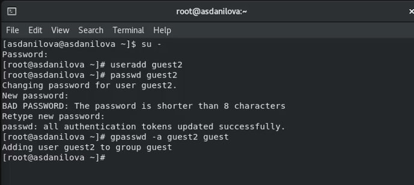
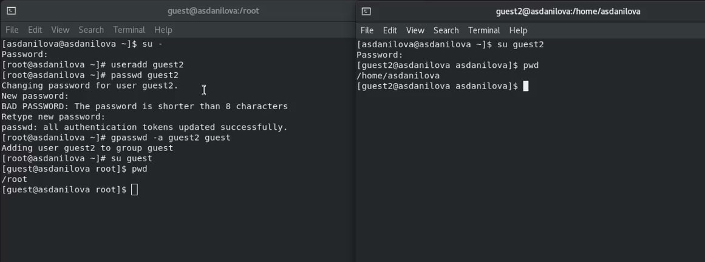
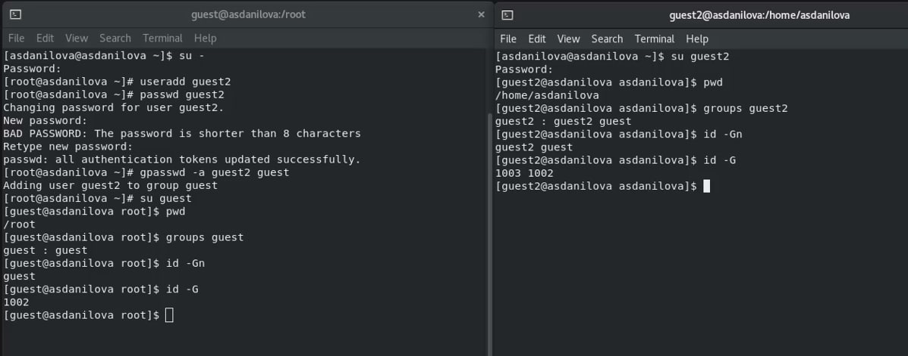
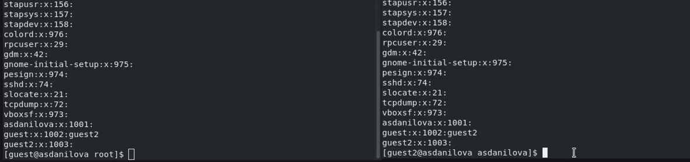
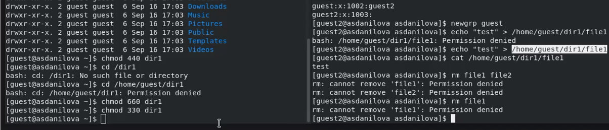

---
# Front matter
lang: ru-RU
title: "Отчёт по лабораторной работе №3"
subtitle: "Дискреционное разграничение прав в Linux. Два пользователя"
author: "Данилова Анастасия Сергеевна"

# Formatting
toc-title: "Содержание"
toc: true # Table of contents
toc_depth: 2
lof: true # List of figures
fontsize: 12pt
linestretch: 1.5
papersize: a4paper
documentclass: scrreprt
polyglossia-lang: russian
polyglossia-otherlangs: english
mainfont: PT Serif
romanfont: PT Serif
sansfont: PT Sans
monofont: PT Mono
mainfontoptions: Ligatures=TeX
romanfontoptions: Ligatures=TeX
sansfontoptions: Ligatures=TeX,Scale=MatchLowercase
monofontoptions: Scale=MatchLowercase
indent: true
pdf-engine: lualatex
header-includes:
  - \linepenalty=10 # the penalty added to the badness of each line within a paragraph (no associated penalty node) Increasing the value makes tex try to have fewer lines in the paragraph.
  - \interlinepenalty=0 # value of the penalty (node) added after each line of a paragraph.
  - \hyphenpenalty=50 # the penalty for line breaking at an automatically inserted hyphen
  - \exhyphenpenalty=50 # the penalty for line breaking at an explicit hyphen
  - \binoppenalty=700 # the penalty for breaking a line at a binary operator
  - \relpenalty=500 # the penalty for breaking a line at a relation
  - \clubpenalty=150 # extra penalty for breaking after first line of a paragraph
  - \widowpenalty=150 # extra penalty for breaking before last line of a paragraph
  - \displaywidowpenalty=50 # extra penalty for breaking before last line before a display math
  - \brokenpenalty=100 # extra penalty for page breaking after a hyphenated line
  - \predisplaypenalty=10000 # penalty for breaking before a display
  - \postdisplaypenalty=0 # penalty for breaking after a display
  - \floatingpenalty = 20000 # penalty for splitting an insertion (can only be split footnote in standard LaTeX)
  - \raggedbottom # or \flushbottom
  - \usepackage{float} # keep figures where there are in the text
  - \floatplacement{figure}{H} # keep figures where there are in the text
---

## Цель лабораторной работы

Получение практических навыков работы в консоли с атрибутами файлов для групп пользователей.

# Процесс выполнения лабораторной работы

1. В установленной операционной системе создайте учётную запись пользователя guest (использую учётную запись администратора):
useradd guest
2. Задайте пароль для пользователя guest (используя учётную запись администратора): passwd guest
3. Аналогично создайте второго пользователя guest2.
4. Добавьте пользователя guest2 в группу guest:
gpasswd -a guest2 guest
  

5. Осуществите вход в систему от двух пользователей на двух разных консолях: guest на первой консоли и guest2 на второй консоли.
6. Для обоих пользователей командой pwd определите директорию, в которой вы находитесь. Сравните её с приглашениями командной строки.

7. Уточните имя вашего пользователя, его группу, кто входит в неё
и к каким группам принадлежит он сам. Определите командами
groups guest и groups guest2, в какие группы входят пользователи guest и guest2. Сравните вывод команды groups с выводом команд
id -Gn и id -G.

8. Сравните полученную информацию с содержимым файла /etc/group.
Просмотрите файл командой cat /etc/group

 

9. От имени пользователя guest2 выполните регистрацию пользователя
guest2 в группе guest командой newgrp guest

10. От имени пользователя guest измените права директории /home/guest,
разрешив все действия для пользователей группы:
chmod g+rwx /home/guest
11. От имени пользователя guest снимите с директории /home/guest/dir1
все атрибуты командой
chmod 000 dirl

Меняя атрибуты у директории dir1 и файла file1 от имени пользователя guest и делая проверку от пользователя guest2, заполните табл. 3.1,
определив опытным путём, какие операции разрешены, а какие нет. Если операция разрешена, занесите в таблицу знак «+», если не разрешена,
знак «-».

## Таблица 1

| Права директории  | Права файла | 1 | 2 | 3 | 4 | 5 | 6 | 7 | 8 |
|-------------------|-------------|-----|-----|-----|----|-----|-------|-----|------|
| d---------(000) |  ----------(000) | - | - | - |- | - | - | - | - |
| d--x------(010) |  ----------(000) | - | - | - |- | + | - | - | + |
| d-w-------(020) |  ----------(000) | - | - | - |- | - | - | - | - |
| d-wx------(030) |  ----------(000) | + | + | - |- | + | - | + | + |
| dr--------(040) |  ----------(000) | - | - | - |- | - | - | - | - |
| dr-x------(050) |  ----------(000) | - | - | - |- | + | + | - | + |
| drw-------(060) |  ----------(000) | - | - | - |- | - | - | - | - |
| drwx------(070) | ----------(000) | + | + | - | - | + | + | + | + |
| d---------(000) | ---x------(010)  | - | - | - | - | - | - | - | - |
| d--x------(010) | ---x------(010)  | - | - | - | - | + | - | - | + |
| d-w-------(020) | ---x------(010)  | - | - | - | - | - | - | - | - |
| d-wx------(030) | ---x------(010)  | + | + | - | - | + | - | + | + |
| dr--------(040) | ---x------(010)  | - | - | - | - | - | - | - | - |
| dr-x------(050) | ---x------(010)  | - | - | - | - | + | + | - | + |
| drw-------(060) | ---x------(010)  | - | - | - | - | - | - | - | - |
| drwx------(070) | ---x------(010) | + | + | - | - | + | + | + | + |
| d---------(000) | --w-------(020) | - | - | - | - | - | - | - | - |
| d--x------(010) | --w-------(020) | - | - | + | - | + | - | - | + |
| d-w-------(020) | --w-------(020) | - | - | - | - | - | - | - | - |
| d-wx------(030) | --w-------(020) | + | + | + | - | + | - | + | + |
| dr--------(040) | --w-------(020) | - | - | - | - | - | - | - | - |
| dr-x------(050) | --w-------(020) | - | - | + | - | + | + | - | + |
| drw-------(060) | --w-------(020) | - | - | - | - | - | - | - | - |
| drwx------(070) | --w-------(020) | + | + | + | - | + | + | + | + |
| d---------(000) | --wx------(030) | - | - | - | - | - | - | - | - |
| d--x------(010) | --wx------(030) | - | - | + | - | + | - | - | + |
| d-w-------(020) | --wx------(030) | - | - | - | - | - | - | - | - |
| d-wx------(030) | --wx------(030) | + | + | + | - | + | - | + | + |
| dr--------(040) | --wx------(030) | - | - | - | - | - | - | - | - |
| dr-x------(050) | --wx------(030) | - | - | + | - | + | + | - | + |
| drw-------(060) | --wx------(030) | - | - | - | - | - | - | - | - |
| drwx------(070) | --wx------(030) | + | + | + | - | + | + | + | + |
| d---------(000) | -r--------(040) | - | - | - | - | - | - | - | - |
| d--x------(010) | -r--------(040) | - | - | - | + | + | - | - | + |
| d-w-------(020) | -r--------(040) | - | - | - | - | - | - | - | - |
| d-wx------(030) | -r--------(040) | + | + | - | + | + | - | + | + |
| dr--------(040) | -r--------(040) | - | - | - | - | - | - | - | - |
| dr-x------(050) | -r--------(040) | - | - | - | + | + | + | - | + |
| drw-------(060) | -r--------(040) | - | - | - | - | - | - | - | - |
| drwx------(070) | -r--------(040) | + | + | - | + | + | + | + | + |
| d---------(000) | -r-x------(050) | - | - | - | - | - | - | - | - |
| d--x------(010) | -r-x------(050) | - | - | - | + | + | - | - | + |
| d-w-------(020) | -r-x------(050) | - | - | - | - | - | - | - | - |
| d-wx------(030) | -r-x------(050) | + | + | - | + | + | - | + | + |
| dr--------(040) | -r-x------(050) | - | - | - | - | - | - | - | - |
| dr-x------(050) | -r-x------(050) | - | - | - | + | + | + | - | + |
| drw-------(060) | -r-x------(050) | - | - | - | - | - | - | - | - |
| drwx------(070) | -r-x------(050) | + | + | - | + | + | + | + | + |
| d---------(000) | -rw-------(060) | - | - | - | - | - | - | - | - |
| d--x------(010) | -rw-------(060) | - | - | + | + | + | - | - | + |
| d-w-------(020) | -rw-------(060) | - | - | - | - | - | - | - | - |
| d-wx------(030) | -rw-------(060) | + | + | + | + | + | - | + | + |
| dr--------(040) | -rw-------(060) | - | - | - | - | - | - | - | - |
| dr-x------(050) | -rw-------(060) | - | - | + | + | + | + | - | + |
| drw-------(060) | -rw-------(060) | - | - | - | - | - | - | - | - |
| drwx------(070) | -rw-------(060) | + | + | + | + | + | + | + | + |
| d---------(000) | -rwx------(070) | - | - | - | - | - | - | - | - |
| d--x------(010) | -rwx------(070) | - | - | + | + | + | - | - | + |
| d-w-------(020) | -rwx------(070) | - | - | - | - | - | - | - | - |
| d-wx------(030) | -rwx------(070) | + | + | + | + | + | - | + | + |
| dr--------(040) | -rwx------(070) | - | - | - | - | - | - | - | - |
| dr-x------(050) | -rwx------(070) | - | - | + | + | + | + | - | + |
| drw-------(060) | -rwx------(070) | - | - | - | - | - | + | - | - |
| drwx------(070) | -rwx------(070) | + | + | + | + | + | + | + | + |

## Таблица 2

|Операция | Права на директорию | Права на файл |
|-----|------|--------|
| Создание файла | d-wx------ (030) | ---------- (000) |
| Удаление файла | d-wx------ (030) | ---------- (000) |
| Чтение файла | d--x------ (010) | -r-------- (040) |
| Запись в файл | d--x------ (010) | --w------- (020) |
| Переименование файла | d-wx------ (030) | ---------- (000) |
| Создание поддиректории | d-wx------ (030) | ---------- (000) |
| Удаление поддиректории | d-wx------ (030) | ---------- (000) |

# Вывод

Мы получили практические навыков работы в консоли с атрибутами файлов для групп пользователей.

