---
## Front matter
lang: ru-RU
title: Дискреционное разграничение прав в Linux. Исследование влияния дополнительных атрибутов
 
author: |
	 \inst{1}

institute: |
	\inst{1}Российский Университет Дружбы Народов

date: 9 сентября, 2023, Москва, Россия

## Formatting
mainfont: PT Serif
romanfont: PT Serif
sansfont: PT Sans
monofont: PT Mono
toc: false
slide_level: 2
theme: metropolis
header-includes:
 - \metroset{progressbar=frametitle,sectionpage=progressbar,numbering=fraction}
 - '\makeatletter'
 - '\beamer@ignorenonframefalse'
 - '\makeatother'
aspectratio: 35
section-titles: true

---

## Выполнила работу:
Данилова Анастасия Сергеевна НПИбд-01-20

## Цель работы

Изучение механизмов изменения идентификаторов, применения
SetUID- и Sticky-битов. Получение практических навыков работы в консоли с дополнительными атрибутами. Рассмотрение работы механизма
смены идентификатора процессов пользователей, а также влияние бита
Sticky на запись и удаление файлов.

##  Создание программы

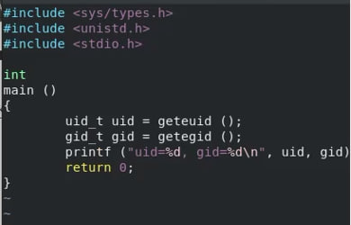

##  Создание программы

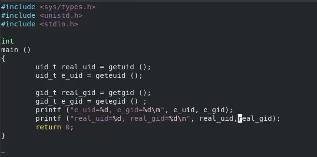

##  Создание программы

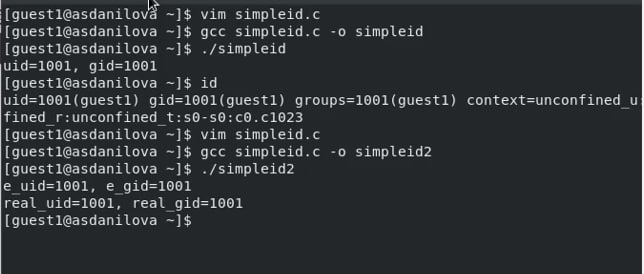

##  Создание программы

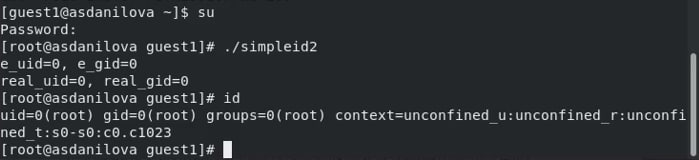

##  Создание программы

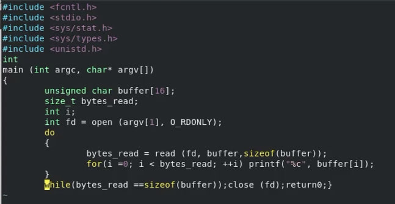

##  Создание программы

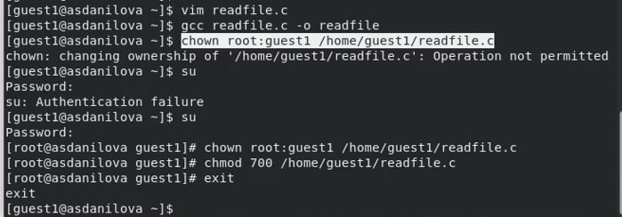

##  Создание программы

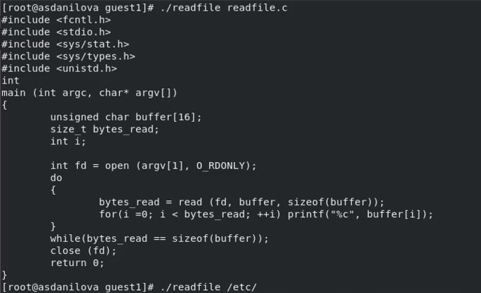

##  Создание программы

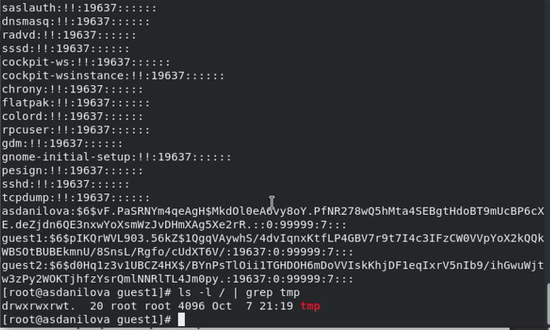

##  Исследование Sticky-бита

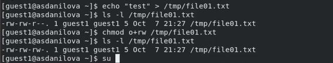

##  Исследование Sticky-бита

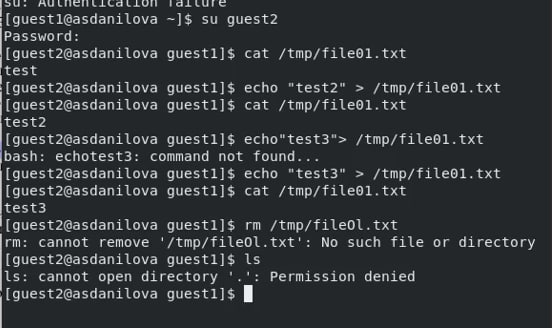

##  Исследование Sticky-бита

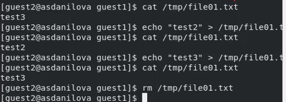

# Выводы по проделанной работе

## Вывод

Мы изучили механизмы изменения идентификаторов, применения
SetUID- и Sticky-битов. Получили практические навыки работы в консоли с дополнительными атрибутами. Рассмотрели работу механизма
смены идентификатора процессов пользователей, а также влияние бита
Sticky на запись и удаление файлов.

