---
## Front matter
lang: ru-RU
title: Мандатное разграничение прав в Linux
 
author: |
	 \inst{1}

institute: |
	\inst{1}Российский Университет Дружбы Народов

date: 14 октября, 2023, Москва, Россия

## Formatting
mainfont: PT Serif
romanfont: PT Serif
sansfont: PT Sans
monofont: PT Mono
toc: false
slide_level: 2
theme: metropolis
header-includes:
 - \metroset{progressbar=frametitle,sectionpage=progressbar,numbering=fraction}
 - '\makeatletter'
 - '\beamer@ignorenonframefalse'
 - '\makeatother'
aspectratio: 35
section-titles: true

---

## Выполнила работу:
Данилова Анастасия Сергеевна НПИбд-01-20

## Цель работы

Развить навыки администрирования ОС Linux. Получить первое практическое знакомство с технологией SELinux1.
Проверить работу SELinx на практике совместно с веб-сервером
Apache.

## Выполнение работы

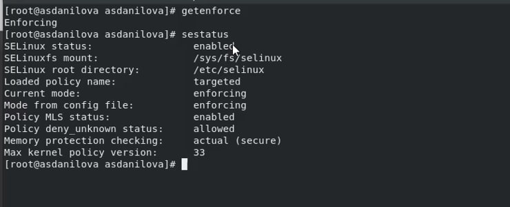

## Выполнение работы

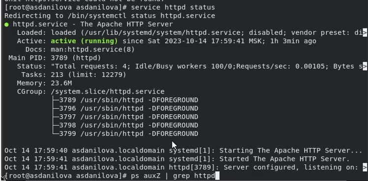

## Выполнение работы

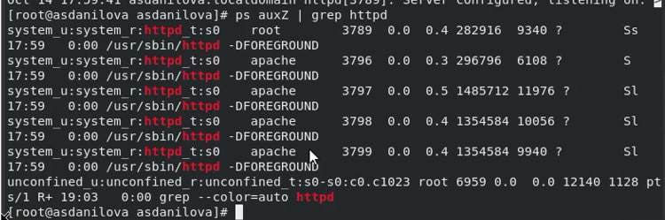

## Выполнение работы

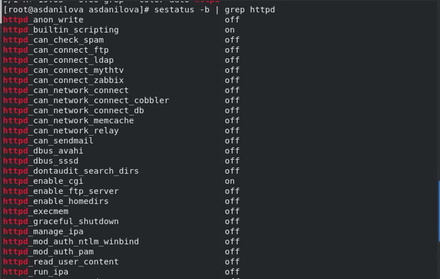 

## Выполнение работы

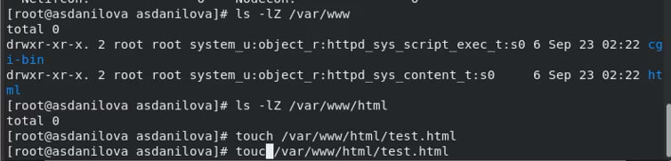

## Выполнение работы

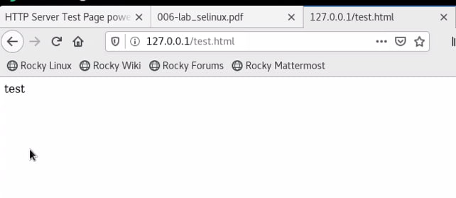

## Выполнение работы

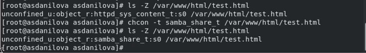

## Выполнение работы

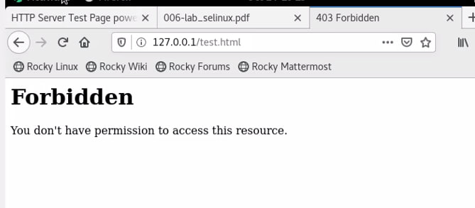

## Выполнение работы

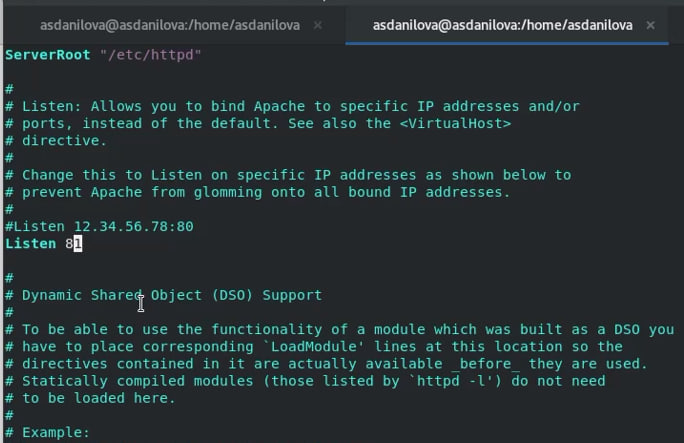

## Выполнение работы

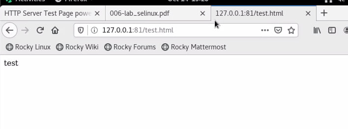

## Выполнение работы

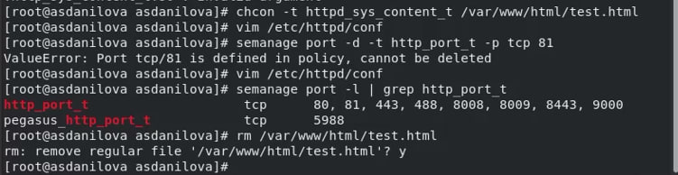

# Выводы по проделанной работе

## Вывод

Мы развили навыки администрирования ОС Linux. Получили первое практическое знакомство с технологией SELinux1.
Проверили работу SELinx на практике совместно с веб-сервером
Apache.

