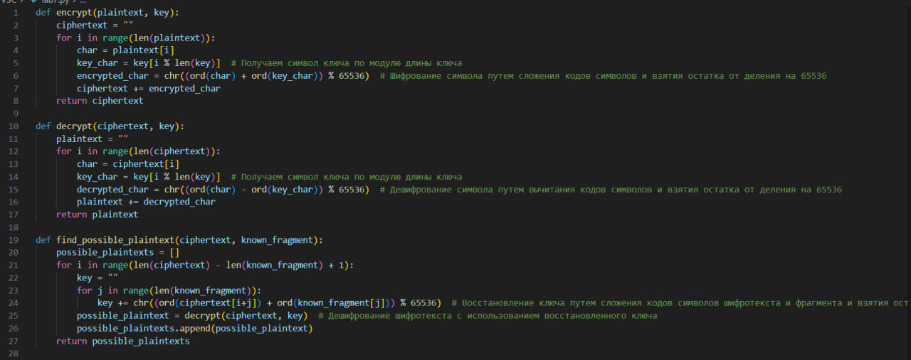
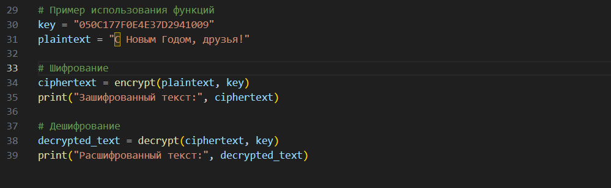

---
## Front matter
lang: ru-RU
title: Элементы криптографии. Однократное гаммирование
 
author: |
	 \inst{1}

institute: |
	\inst{1}Российский Университет Дружбы Народов

date: 21 октября, 2023, Москва, Россия

## Formatting
mainfont: PT Serif
romanfont: PT Serif
sansfont: PT Sans
monofont: PT Mono
toc: false
slide_level: 2
theme: metropolis
header-includes:
 - \metroset{progressbar=frametitle,sectionpage=progressbar,numbering=fraction}
 - '\makeatletter'
 - '\beamer@ignorenonframefalse'
 - '\makeatother'
aspectratio: 35
section-titles: true

---

## Цель работы

Освоить на практике применение режима однократного гаммирования.

## Выполнение работы

Однократное гаммирование - это метод шифрования, при котором каждый символ открытого текста (бит) комбинируется с символом ключа посредством операции XOR, чтобы получить символ шифротекста (зашифрованный бит). Смысл этого метода состоит в том, чтобы внести случайность и неопределенность в процесс шифрования, делая его более надежным.

## Выполнение работы

## Выполнение работы

## Выполнение работы

 

# Выводы по проделанной работе

## Вывод

Мы освоили на практике применение режима однократного гаммирования.

