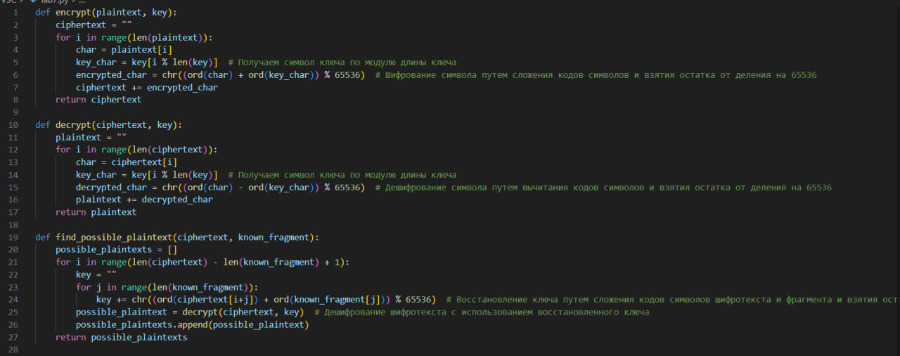
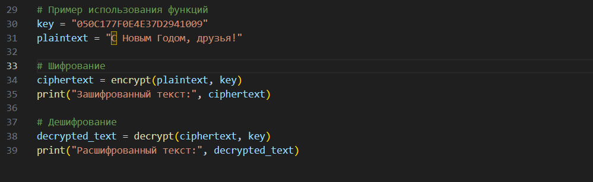

---
# Front matter
lang: ru-RU
title: "Отчёт по лабораторной работе №7"
subtitle: "Элементы криптографии. Однократное гаммирование"
author: "Данилова Анастасия Сергеевна"

# Formatting
toc-title: "Содержание"
toc: true # Table of contents
toc_depth: 2
lof: true # List of figures
fontsize: 12pt
linestretch: 1.5
papersize: a4paper
documentclass: scrreprt
polyglossia-lang: russian
polyglossia-otherlangs: english
mainfont: PT Serif
romanfont: PT Serif
sansfont: PT Sans
monofont: PT Mono
mainfontoptions: Ligatures=TeX
romanfontoptions: Ligatures=TeX
sansfontoptions: Ligatures=TeX,Scale=MatchLowercase
monofontoptions: Scale=MatchLowercase
indent: true
pdf-engine: lualatex
header-includes:
  - \linepenalty=10 # the penalty added to the badness of each line within a paragraph (no associated penalty node) Increasing the value makes tex try to have fewer lines in the paragraph.
  - \interlinepenalty=0 # value of the penalty (node) added after each line of a paragraph.
  - \hyphenpenalty=50 # the penalty for line breaking at an automatically inserted hyphen
  - \exhyphenpenalty=50 # the penalty for line breaking at an explicit hyphen
  - \binoppenalty=700 # the penalty for breaking a line at a binary operator
  - \relpenalty=500 # the penalty for breaking a line at a relation
  - \clubpenalty=150 # extra penalty for breaking after first line of a paragraph
  - \widowpenalty=150 # extra penalty for breaking before last line of a paragraph
  - \displaywidowpenalty=50 # extra penalty for breaking before last line before a display math
  - \brokenpenalty=100 # extra penalty for page breaking after a hyphenated line
  - \predisplaypenalty=10000 # penalty for breaking before a display
  - \postdisplaypenalty=0 # penalty for breaking after a display
  - \floatingpenalty = 20000 # penalty for splitting an insertion (can only be split footnote in standard LaTeX)
  - \raggedbottom # or \flushbottom
  - \usepackage{float} # keep figures where there are in the text
  - \floatplacement{figure}{H} # keep figures where there are in the text
---

## Цель лабораторной работы

Освоить на практике применение режима однократного гаммирования.

#  Выполнение работы

Нужно подобрать ключ, чтобы получить сообщение «С Новым Годом,
друзья!». Требуется разработать приложение, позволяющее шифровать и
дешифровать данные в режиме однократного гаммирования. Приложение
должно:
1. Определить вид шифротекста при известном ключе и известном открытом тексте.
2. Определить ключ, с помощью которого шифротекст может быть преобразован в некоторый фрагмент текста, представляющий собой один из
возможных вариантов прочтения открытого текста.

## Контрольные вопросы

1. Поясните смысл однократного гаммирования.

Шифрование гаммированием — это шифрование симметричным методом, сущность которого заключается в «наложении» последовательности, сформированной из случайных чисел, на открытый текст.
При шифровании гаммированием используется последовательность случайных символов (гамма), которая комбинируется с исходным текстом с использованием операции XOR.
2. Перечислите недостатки однократного гаммирования.

- Если ключ слишком короткий, может возникнуть проблема обратного расчета ключа из шифротекста и открытого текста.
- Если ключ слишком длинный, он может быть сложным для генерации и передачи.
- Если ключ повторяется в процессе шифрования, можно легко восстановить ключ и расшифровать сообщение.

3. Перечислите преимущества однократного гаммирования.

- Если ключ длинный и случайно сгенерирован, алгоритм становится практически непреодолимым для взлома.
- Однократное гаммирование обеспечивает высокую стойкость к пассивному перехвату шифротекста.
- При использовании случайного ключа и правильной реализации, алгоритм обеспечивает конфиденциальность передаваемой информации.

4. Почему длина открытого текста должна совпадать с длиной ключа?

Длина открытого текста должна совпадать с длиной ключа, чтобы каждый символ открытого текста мог быть комбинирован с символом ключа для создания символа шифротекста. Если длина открытого текста меньше, лишний ключ может быть неправильно использован или игнорирован. Если длина открытого текста больше, часть ключа может остаться не использованной.

5. Какая операция используется в режиме однократного гаммирования, назовите её особенности?

В режиме однократного гаммирования используется операция XOR (исключающее ИЛИ). Ее особенность заключается в том, что она позволяет объединять символы открытого текста и ключа таким образом, что если символы совпадают, результат будет 0, если не совпадают - результат будет 1.

6. Как по открытому тексту и ключу получить шифротекст?

Для получения шифротекста по открытому тексту и ключу, каждый символ открытого текста комбинируется с соответствующим символом ключа с использованием операции XOR.

7. Как по открытому тексту и шифротексту получить ключ?

По открытому тексту и шифротексту невозможно получить точный ключ. Шифротекст не содержит информации о ключе, если ключ был случайно сгенерирован и процесс шифрования был правильно выполнен.

8. В чем заключаются необходимые и достаточные условия абсолютной стойкости шифра?

- Ключ должен быть такой же длины, как и открытый текст, и должен быть случайно сгенерирован.
- Ключ должен использоваться только один раз для каждого открытого текста (не должен повторяться).
- Алгоритм шифрования должен быть выполняться правильно без ошибок или утечек информации.

# Вывод

Мы освоили на практике применение режима однократного гаммирования.
