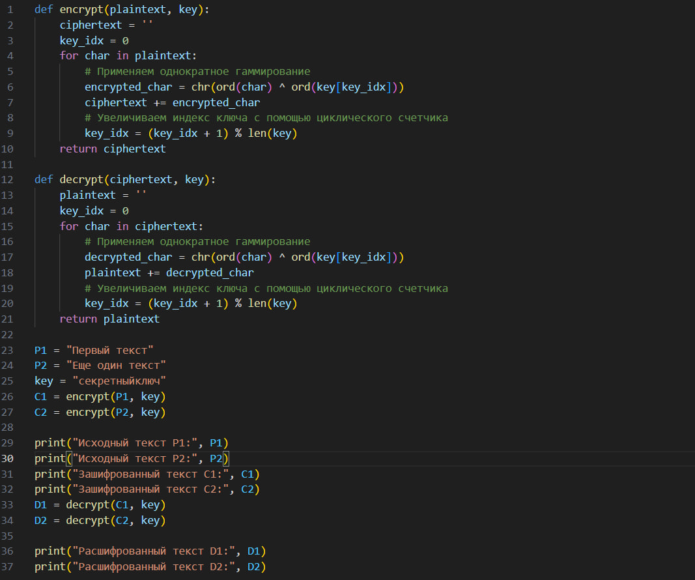
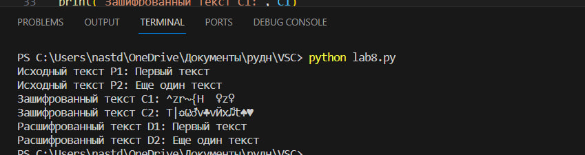

---
## Front matter
lang: ru-RU
title: Элементы криптографии. Шифрование различных текстов одним ключом.
 
author: |
	 \inst{1}

institute: |
	\inst{1}Российский Университет Дружбы Народов

date: 28 октября, 2023, Москва, Россия

## Formatting
mainfont: PT Serif
romanfont: PT Serif
sansfont: PT Sans
monofont: PT Mono
toc: false
slide_level: 2
theme: metropolis
header-includes:
 - \metroset{progressbar=frametitle,sectionpage=progressbar,numbering=fraction}
 - '\makeatletter'
 - '\beamer@ignorenonframefalse'
 - '\makeatother'
aspectratio: 35
section-titles: true

---

## Цель работы

Освоить на практике применение режима однократного гаммирования на примере кодирования различных исходных текстов одним ключом.

## Выполнение работы

Два текста кодируются одним ключом (однократное гаммирование).
Требуется не зная ключа и не стремясь его определить, прочитать оба текста. Необходимо разработать приложение, позволяющее шифровать и дешифровать тексты P1 и P2 в режиме однократного гаммирования. Приложение должно определить вид шифротекстов C1 и C2 обоих текстов P1 и P2 при известном ключе.

## Выполнение работы

## Выполнение работы

# Выводы по проделанной работе

## Вывод

Мы освоили на практике применение режима однократного гаммирования на примере кодирования различных исходных текстов одним ключом.

