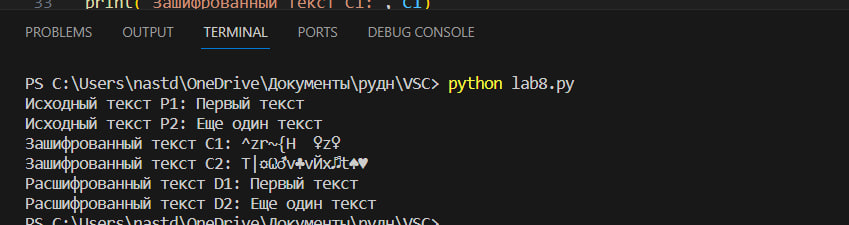

---
# Front matter
lang: ru-RU
title: "Отчёт по лабораторной работе №8"
subtitle: "Элементы криптографии. Шифрование (кодирование) различных исходных текстов одним ключом"
author: "Данилова Анастасия Сергеевна"

# Formatting
toc-title: "Содержание"
toc: true # Table of contents
toc_depth: 2
lof: true # List of figures
fontsize: 12pt
linestretch: 1.5
papersize: a4paper
documentclass: scrreprt
polyglossia-lang: russian
polyglossia-otherlangs: english
mainfont: PT Serif
romanfont: PT Serif
sansfont: PT Sans
monofont: PT Mono
mainfontoptions: Ligatures=TeX
romanfontoptions: Ligatures=TeX
sansfontoptions: Ligatures=TeX,Scale=MatchLowercase
monofontoptions: Scale=MatchLowercase
indent: true
pdf-engine: lualatex
header-includes:
  - \linepenalty=10 # the penalty added to the badness of each line within a paragraph (no associated penalty node) Increasing the value makes tex try to have fewer lines in the paragraph.
  - \interlinepenalty=0 # value of the penalty (node) added after each line of a paragraph.
  - \hyphenpenalty=50 # the penalty for line breaking at an automatically inserted hyphen
  - \exhyphenpenalty=50 # the penalty for line breaking at an explicit hyphen
  - \binoppenalty=700 # the penalty for breaking a line at a binary operator
  - \relpenalty=500 # the penalty for breaking a line at a relation
  - \clubpenalty=150 # extra penalty for breaking after first line of a paragraph
  - \widowpenalty=150 # extra penalty for breaking before last line of a paragraph
  - \displaywidowpenalty=50 # extra penalty for breaking before last line before a display math
  - \brokenpenalty=100 # extra penalty for page breaking after a hyphenated line
  - \predisplaypenalty=10000 # penalty for breaking before a display
  - \postdisplaypenalty=0 # penalty for breaking after a display
  - \floatingpenalty = 20000 # penalty for splitting an insertion (can only be split footnote in standard LaTeX)
  - \raggedbottom # or \flushbottom
  - \usepackage{float} # keep figures where there are in the text
  - \floatplacement{figure}{H} # keep figures where there are in the text
---

## Цель лабораторной работы

Освоить на практике применение режима однократного гаммирования
на примере кодирования различных исходных текстов одним ключом.

#  Выполнение работы

Два текста кодируются одним ключом (однократное гаммирование).
Требуется не зная ключа и не стремясь его определить, прочитать оба текста. Необходимо разработать приложение, позволяющее шифровать и дешифровать тексты P1 и P2 в режиме однократного гаммирования. Приложение должно определить вид шифротекстов C1 и C2 обоих текстов P1 и P2 при известном ключе ; Необходимо определить и выразить аналитически способ, при котором злоумышленник может прочитать оба текста, не зная ключа и не стремясь его определить.

## Контрольные вопросы

1. Как, зная один из текстов (P1 или P2), определить другой, не зная при
этом ключа?

Для определения другого текста без знания ключа можно использовать метод криптоанализа, который включает в себя анализ частотности букв, поиски общих слов или выражений, анализ повторяющихся блоков и другие методы. Однако, без ключа дешифрование текста может быть сложным и требовать большого количества времени и вычислительных ресурсов.

2. Что будет при повторном использовании ключа при шифровании текста?
 
 При повторном использовании ключа при шифровании текста возможно нарушение криптографической стойкости и приведение к возможности восстановления ключа или дешифрования текста без его использования. Поэтому рекомендуется использовать каждый ключ только один раз.

3. Как реализуется режим шифрования однократного гаммирования одним
ключом двух открытых текстов?

В режиме шифрования однократного гаммирования одним ключом двух открытых текстов каждый открытый текст сначала обрабатывается с помощью операции XOR с ключом, а затем происходит операция XOR между зашифрованными текстами. Таким образом, ключ применяется только один раз для шифрования каждого открытого текста.

4. Перечислите недостатки шифрования одним ключом двух открытых
текстов.

Недостатки шифрования одним ключом двух открытых текстов включают возможность угадывания ключа или дешифрования текста, если злоумышленник имеет доступ к нескольким парам зашифрованных и открытых текстов. Кроме того, использование одного и того же ключа для нескольких текстов может привести к компрометации стойкости шифрования или к "слабым" ключам.

5. Перечислите преимущества шифрования одним ключом двух открытых
текстов.

Преимущества шифрования одним ключом двух открытых текстов включают уменьшение объема ключевого материала, что упрощает его хранение и управление. Это также может сэкономить вычислительные ресурсы и время, поскольку для шифрования и расшифрования двух текстов требуется всего одно применение ключа. Если ключ надежен и хорошо защищен, шифрование одним ключом двух текстов может быть безопасным и эффективным методом шифрования.

# Вывод

Мы освоили на практике применение режима однократного гаммирования на примере кодирования различных исходных текстов одним ключом.
